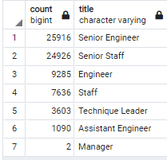
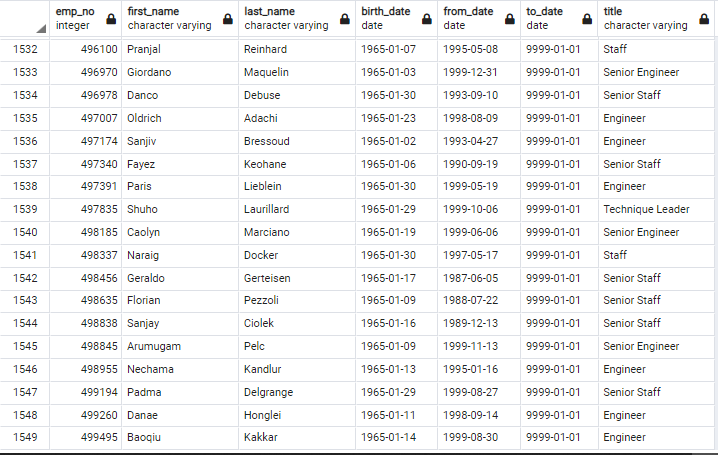

# Pewlett Hackard Analysis

## Overview

### Background
With the upcoming retirement of millions of baby boomers from the workforce, Pewlett Hackard needs to future proof their company to make sure they are prepared for the upcoming retirement of a lot of their workforce.

### Purpose
The purpose of this analysis was to determine the number of retiring employees per title, as well as identify employees that are eligible for the company's mentorship program

## Results
- From the analysis, I can conclude that the company will have to prepare for people retiring in large numbers from almost all their departments. 
- The largest loss of employees are Senior Engineers, and Senior Staff with over 20,000 employees leaving with each title.
- There are only two managers retiring, so this will not be as big of a strain on the company to replace.

- There are over 1500 employees eligible for the mentorship program.

## Summary
In total 72,458 roles will need to be filled as the "silver tsunami" begins to make an impact. This will have a massive effect on the company and needs to be prepared for in turn. 

There are not enough qualified, retirement-ready employees in the departments to mentor the next generation of employees. Even if every employee eligible for the mentorship program decides to join instead of retiring, there would still be almost 50 employees for each mentor if they were spread evenly. This is too many employees for a meaningful mentoring relationship.  

The true number of employees there would be per mentor would be better understood with a query finding the number of mentorship program ready employees in each department. With this, we could see the number of mentors in each department, and then how many new employees in each department that would need a mentor. 

The current number of retirement ready employees we have is per title, so it would also be good to have a query of how many employees are retirement ready from each department. This would also help us to understand the number of mentors per employee in each department. 
